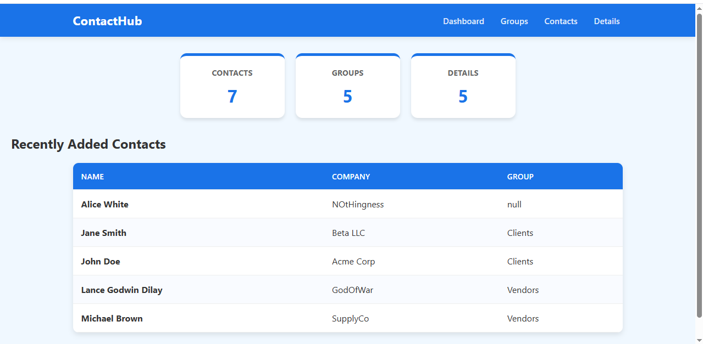
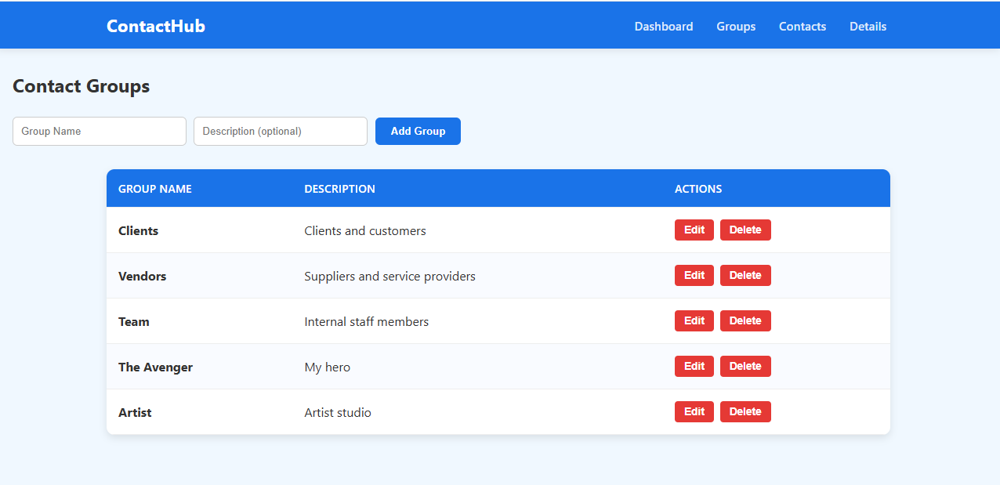
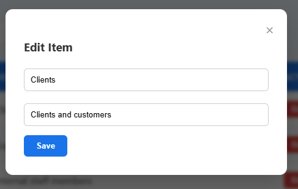
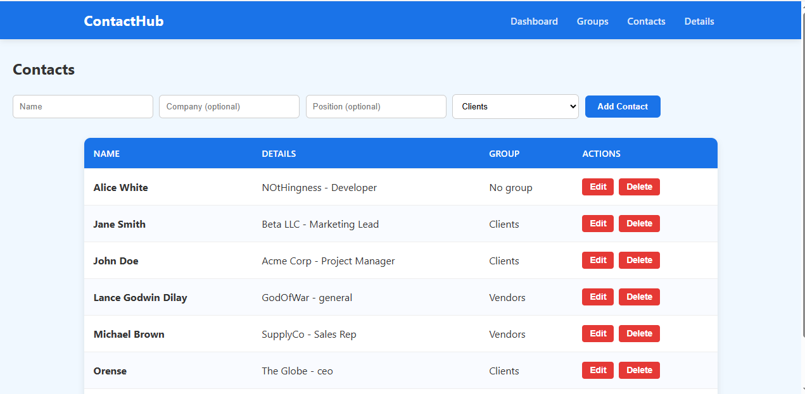
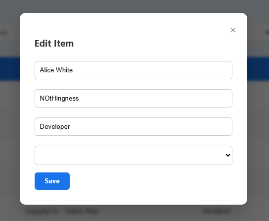
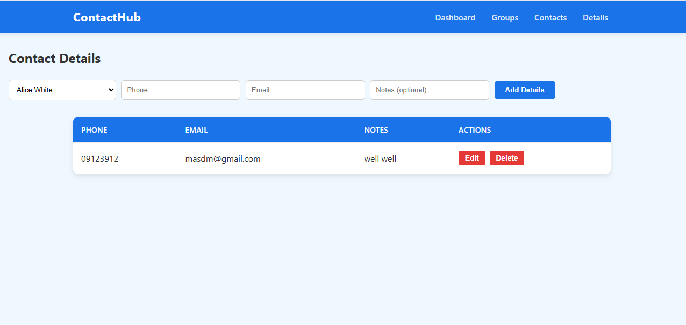
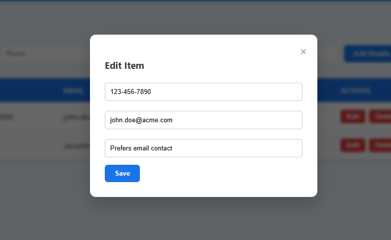

## How to Run the Project
1. Open the project in Visual Studio.
2. Import the database:
   ```sql
   -- In your MySQL Workbench
   source contact_db.sql;
3. Update the database connection in server.js:
  ```js
    const db = mysql.createConnection({
      host: 'localhost',
      user: 'root',
      password: '', 
      database: 'contact_db'
      });
  ```
4. Open a terminal in the project folder, go to the backend folder: **cd backend**
5. Start the server: **node server.js**
6. Open index.html in your browser to access the system.


## System Screenshots in Action

### Homepage / Dashboard


### Group Page



### Contacts Page



### Borrow & Return Page



---